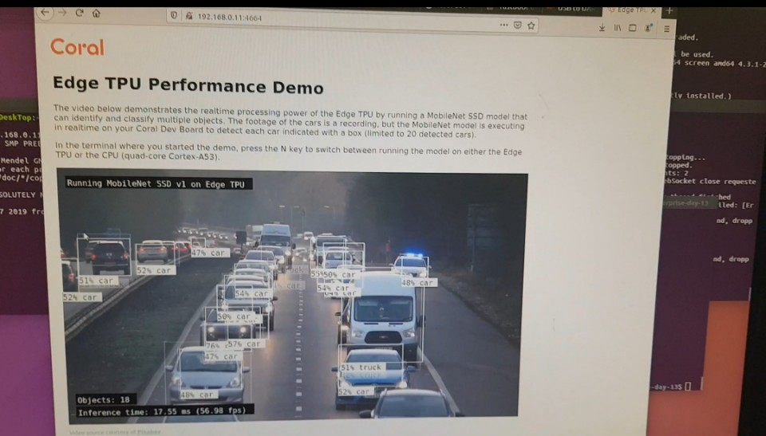

# Coral-Board
Coral board set up과 예제 실행해보기
 학교에서 연구실 인턴쉽을 진행하며 엣지 컴퓨팅에 대해 공부하게 되어 coral board를 사용해 볼 수 있었다. coral board는 구글에서 개발하였으며 머신러닝에 특화된 Edge TPU를 장착하고 있다. 따라서 neural network model의 inference 수행 시간이 매우 짧은 성능을 보여준다.  

## 1. Flash the board
>  1. host computer에 udev rule을 설치
   
    sudo sh -c "echo 'SUBSYSTEM == \"usb \ ", ATTR {idVendor} == \"0525 \ ", MODE = \"0664 \ ", \
    GROUP = \ "plugdev \", TAG + = \ "uaccess \" '>> /etc/udev/rules.d/65-edgetpu-board.rules "

    sudo udevadm 제어 --reload-rules &&  sudo udevadm 트리거
>  2. 시리얼 콘솔에 연결한다.(파워는 연결하지 않는다.)
  micro-B USB케이블을 사용해 시리얼 포트에 연결한다.
   
    dmesg  |  grep ttyUSB
    
    [ 6437.706335 ] usb 2-13.1 : 이제 ttyUSB0에 연결된 CP210x 변환기
    [ 6437.708049 ] usb 2-13.1 : 이제 ttyUSB1에 연결된 CP210x 변환기
    
    screen / dev / ttyUSB0 115200 

>  3. power 공급
  micro-C USB케이블을 사용해 전원 포트에 연결한다.
   
>  4. fastboot 시작
u-boot prompt에서 다음을 실행한다.
   
    fastboot 0
## 2. Connect to the board's shell via MDT
>  1. host에 MDT 설치 (환경변수를 설정하여 준다!)
   
    pip3 install --user mendel-development-tool
>  2. host에서 장치를 볼 수 있는지 확인한다.
   
    mdt devices #호스트 이름 및 ip주소를 출력하여야 한다.
## 3. Internet
>  1. 인터넷에 연결되어있는지 확인한다.
   
    nmcli connection show
    
## 4. Update the Mendel software
>  1. 최신 소프트웨어로 업데이트
   
    sudo apt-get update
    sudo apt-get dist-upgrade
 >  2. Tensorflow Lite Python runtime 설치
 
    wget https://dl.google.com/coral/python/tflite_runtime-1.14.0-cp37-cp37m-linux_aarch64.whl
    pip3 install tflite_runtime-1.14.0-cp37-cp37m-linux_aarch64.whl
    

## 5. 예제 실행
>  1. 비디오 데모를 보기 위해 DevBoard 터미널에서 다음 명령을 실행한다.
   
    mdt shell
    edgetp_demo --stream
    
연결 후, 브라우저에서 포트 4664를 사용하여 열면 비디오가 재생되는 것을 볼 수 있다. DevBoard에서 녹화되어 있는 영상 내 자동차를 실시간으로 감지한다.  

## 6. 참고 자료
https://coral.ai/docs/dev-board/get-started#2-connect-to-the-boards-shell-via-mdt
https://goodtogreate.tistory.com/entry/Coral-Dev-Board-Google-Edge-TPU-%EC%84%A4%EC%A0%95-%EB%B0%8F-%EC%82%AC%EC%9A%A9%ED%9B%84%EA%B8%B0
